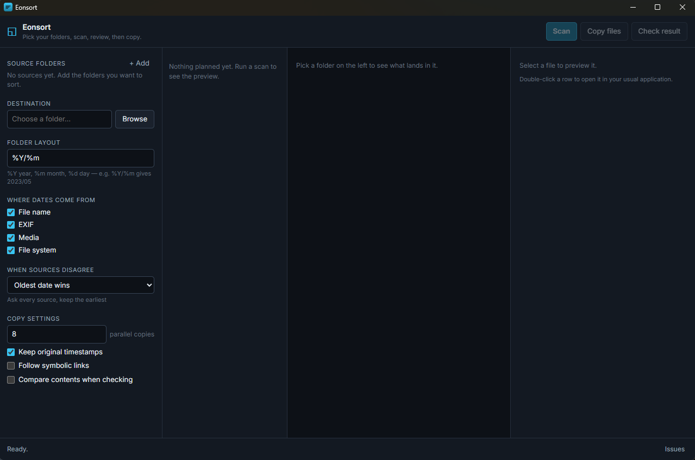

# eonsort

[](https://github.com/it-atelier-gn/eonsort/actions)
[](https://www.rust-lang.org/)
[](https://tauri.app/)
[](LICENSE)

Sorts files into date-based folders by the date they were actually created, not the date a backup
tool last touched them.

Point it at your photo folders, press **Scan**, and you get the full resulting tree as a preview
before a byte is copied. Then press **Copy files**. Sources are only ever read.

The tree is a table: **Folder**, **Files** and **Size**, each column sized to what is in it, drag
the edge of a heading to set a width of your own or double-click that edge to fit the contents
again, and drag the heading itself to reorder. Widths and order are both remembered. Clicking a
folder shows everything underneath it, so a year lists its whole year rather than nothing at all,
and a time range picked in **Charts** prunes the tree to match.

In the file list, <kbd>↑</kbd> and <kbd>↓</kbd> walk from file to file with the preview pane
following the selection, <kbd>Home</kbd> and <kbd>End</kbd> jump to either end, and <kbd>Enter</kbd>
opens the selected file. The installed version is shown at the right-hand end of the status bar.

Windows, Linux and macOS — desktop app and `eonsort` command line tool.



---

## How the date is found

| Source | What it reads |
|---|---|
| **File name** | `IMG_20230506_101112.jpg`, `Screenshot 2021-07-04 at 09.05.01.png`, `Rechnung 06.05.2021.pdf`, and many more shapes |
| **EXIF** | `DateTimeOriginal` and friends in JPEG, TIFF, PNG, WebP, HEIF and common raw formats |
| **Media** | `com.apple.quicktime.creationdate` where a phone wrote one, otherwise the `mvhd` box of MP4, MOV, M4A and related containers |
| **Google Takeout** | `photoTakenTime` in the JSON sidecar a Google Photos export leaves beside each file |
| **File system** | Whichever of created / modified is older |

A Google Photos export is the most common way a collection loses its dates: Takeout strips the
capture time out of the file and parks it in a sidecar. Eonsort reads that sidecar back, including
the shapes Takeout actually writes — `IMG_1234.JPG.json`, `IMG_1234.JPG.supplemental-metadata.json`,
names cut short to fit its 51 character limit, `IMG_1234.JPG(1).json` beside a numbered copy, and an
`-edited` picture falling back to the original's sidecar.

Every source that reports a date is kept. Each can be switched off. Three rules choose between them:

| Rule | What it does |
|---|---|
| **Weigh the evidence** (default) | Discards impossible dates, then prefers the one two sources agree on |
| **Oldest date wins** | Keeps the earliest date any source reports |
| **First match wins** | Walks the sources in order, stops at the first hit |

## Finding a picture by what is in it

Tick **Look at pictures and tag them after a scan**. Once the scan finishes, eonsort works through
the pictures in the background — the scan itself is never held up — and gives each one a handful of
plain tags: *a forest*, *a dog*, *a birthday party*. Tags show in the preview pane.

It also keeps the embedding it computed, so the search box takes ordinary words rather than tag
names. Type `forest and dog` and press Enter; every view narrows to the pictures that match, ranked
by how well. **Clear** puts everything back.

The work is [SigLIP](https://huggingface.co/google/siglip-base-patch16-224) running locally on the
CPU — nothing leaves your machine, and no runner needs hosting. Released builds ship with it; all it
needs is a one-off download of about 780 MB, offered in the setup panel. A build of your own needs
the `tagging` feature turned on:

```sh
cargo tauri build --features upright,tagging
```

Weights land in `models/` inside the app data folder; delete that folder to reclaim the space.
Pictures already tagged are skipped when the pass runs again, so a second scan only looks at what is
new. Without the feature, the search box still works — it falls back to matching your words against
tags already stored.

Tags live in a `*.tags.json` file beside the plan.

## Files that belong together

A live photo is two files, `IMG_1234.HEIC` and `IMG_1234.MOV`, and their dates rarely match: the
picture carries EXIF, the video carries whatever its container says. Sorted separately they land in
two different folders. The same goes for a RAW beside its JPEG, and for `.xmp`, `.aae`, `.thm` and
Takeout `.json` sidecars, which carry no date of their own worth having.

**Keep files that belong together on one date** groups files by name within a folder, picks the one
with the most trustworthy date as the master — a picture over a video, a video over a sidecar — and
gives the rest that date. The preview names the master, as *beside IMG_1234.HEIC*. On the command
line the grouping is on by default; `--split-companions` turns it off.

## When the date is wrong

A camera whose battery died resets its clock to a factory default — usually 1 January of 2000, 2003
or 2015 — and every photo after that carries a date that looks real. Eonsort flags rather than
quietly misfiles:

- a date on a factory-reset instant, in the future, or later than the file was written
- a run of files counting up from a reset date while the files were written years later
- a batch sharing one timestamp to the second
- a file stranded years from everything else in its folder, or out of step with its camera's counter

A whole number of hours between two sources is reported as a note rather than a fault: that is the
shape of a time zone, not of a wrong date. Videos are the usual cause, because `mvhd` records UTC
with no zone at all. Where a phone also wrote `com.apple.quicktime.creationdate`, eonsort takes that
instead, so a clip filmed abroad keeps the wall clock time it was filmed at rather than being shifted
into the zone of the machine doing the sorting. Photos carry the same information in
`OffsetTimeOriginal`, which is shown beside the date it came from.

Flagged files appear under **Issues**; clicking a group selects them. In the preview pane you can
take the date from another source, type one in, or anchor one file to its true date and shift the
whole selection by that offset, keeping the gaps intact.

Corrections live in a `*.overrides.json` file beside the plan. They survive reopening, they are what
the copy uses, and any of them can be undone. A file that has already been copied refuses to be
re-dated.

## Seeing it rather than reading it

Three visual tabs. In the two walkable ones: click to take the mouse,
<kbd>W</kbd><kbd>A</kbd><kbd>S</kbd><kbd>D</kbd> to move, <kbd>Shift</kbd> to run, mouse to look,
<kbd>Esc</kbd> to give the mouse back.

### Timeline

The whole plan in 3D, one point per date each source reported, coloured by confidence. Three
layouts, morphing between them:

| Layout | What it shows |
|---|---|
| **Disagreement field** | Time across, one lane per source, depth by how many files stack up. Agreeing sources collapse to a tick; EXIF 2003 against file system 2019 draws a long red streak. |
| **Time helix** | One turn per year, month around the turn, hour of day as radius. Bad dates lift out of the disc. |
| **Memory terrain** | Time across, hour of day in depth, file count as height. A reset date becomes a spire on an empty plain. |

Detail follows distance: zoomed out, one muted dot per file with only suspect dates keeping their
colour; closer, every source's reading and the full colour key; closer still, the photographs
themselves in place, with videos playing. Long empty stretches are compressed so a lonely 2003
island and a dense 2019 cluster are both readable on one axis. Clicking a point opens that file in
the preview pane. **Auto-fly** cruises from oldest to newest; any drag takes the controls back.

### Gallery

Builds a building out of your archive. One room per period, oldest first, a longer hall for a busy
year. Pictures hang at eye height, videos play in frame, daylight falls through a clerestory band.
Rooms open into one another as one enfilade. Look at a picture for its name and date; click or press
<kbd>E</kbd> to open it in the preview pane.

### Charts

The same questions in flat 2D, often quicker to read:

| Figure | The question it answers |
|---|---|
| **When your files were made** | A square per month, year by year. Where are the gaps? Click in to go finer. |
| **Time of day** | Do the hours look like a camera roll? A midnight spike means dates with no time. |
| **Where each date came from** | Which source was trusted. A large "file system" share means many dates are really copy dates. |
| **How sure eonsort is** | The timeline's four colours, with what each means. |
| **Where the bulk lands** | The fullest destination folders — one outsized folder is usually where unknown dates collected. |

The first figure is also the way in. Click a square to drop into it, drag for a range, or click a
row label for a whole year; the grid refines from years to months to days to hours.

Whatever you pick scopes the whole app: every figure recounts itself, and the folder tree, Timeline
and Gallery show only those files. A bar under the toolbar tracks where you are — `All time › 2019 ›
Mar 2019` — each step clickable, plus **Back** and **Show all**. Scanning again clears it.

## Turning pictures upright

Cameras store a sideways photo the way the sensor saw it, with an orientation tag saying which way
is up. Plenty of software ignores the tag.

Tick **Turn pictures upright when copying** before scanning. The scan records what the copy should
do; the copy turns the pixels for real and sets the tag to "already upright", so the result looks
right everywhere. Originals are never touched.

For JPEGs the turn is genuinely lossless — compressed data is rearranged, not decoded and
recompressed — and the EXIF block survives intact.

The preview shows every picture as it will be copied, and any of them can be corrected:

| Key | |
|---|---|
| `[` | quarter turn left |
| `]` | quarter turn right |
| `\` | upside down |
| `0` | back to what the tag asked for |

The same buttons sit under the preview; selecting several files gives a bulk turn in the bottom bar.

Non-JPEGs, and JPEGs whose dimensions are not a whole number of compression blocks, cannot be turned
losslessly. They are copied untouched and the preview says so. A button will turn one anyway, naming
the cost: re-encoding and dropped metadata.

Turns live in `*.rotations.json` beside the plan, and a copied file refuses to be turned. One
caveat: the small thumbnail inside a photo's own EXIF block is left as it was, so a viewer showing
that thumbnail may still show it sideways.

## Safety

- **Nothing is overwritten.** Same-name files are compared by content; identical ones are left alone, different ones stored beside as `name_dup_1.jpg`.
- **Every copy is atomic.** Written to staging, flushed, then renamed into place.
- **Everything resumes.** The scan appends to its plan, the copy keeps a journal. Stopping a run, or losing power, costs nothing.
- **Sources are only ever read.**

## Quick Start

Grab an installer from the [releases page](https://github.com/it-atelier-gn/eonsort/releases), or
build it yourself.

**Prerequisites**

- [Rust](https://rustup.rs/) 1.87+
- [Node.js](https://nodejs.org/) 20+ with npm
- [CMake](https://cmake.org/) and [NASM](https://nasm.us/), for the bundled libjpeg-turbo
- Linux: `libwebkit2gtk-4.1-dev libappindicator3-dev librsvg2-dev patchelf`
- Windows: the [WebView2 runtime](https://developer.microsoft.com/en-us/microsoft-edge/webview2/), pre-installed on Windows 11 and most Windows 10

```sh
git clone https://github.com/it-atelier-gn/eonsort.git
cd eonsort
npm install
npx tauri dev          # npx tauri build for release bundles
```

---

## Command line

The same engine ships as `eonsort`, for scheduled jobs and very large archives.

```sh
cargo build --release -p eonsort-cli
```

Sort in one step:

```sh
eonsort sort --source "D:\Photos" "D:\Downloads" --destination "E:\Sorted"
```

Or run the phases separately and review the plan in between:

```sh
eonsort scan --source "D:\Photos" --plan photos.jsonl
eonsort show --plan photos.jsonl --suspect     # only entries whose date looks wrong
eonsort copy --plan photos.jsonl --destination "E:\Sorted"
eonsort verify --plan photos.jsonl --hash
```

`--destination` is optional on `scan` — leave it out to see the folder layout before deciding where
it goes, and the plan records relative paths. Naming it on `copy` re-points the plan.

| Flag | Meaning |
|---|---|
| `--pattern "%Y/%m"` | Destination layout. Any strftime pattern, e.g. `%Y/%Y-%m-%d`. |
| `--destination "E:\Sorted"` | Where the sorted tree goes. Optional on `scan`; on `copy` it sets or changes where an existing plan lands. |
| `--provider filename exif` | Only these date sources, in this order. |
| `--strategy oldest` | Earliest date reported. `priority` stops at the first source that reports one. |
| `--suspect` | On `show`, list only entries whose date looks wrong. |
| `--auto-rotate` | On `scan`, note sideways pictures so the copy turns them upright. |
| `--split-companions` | On `scan`, date each file on its own rather than keeping live photo, RAW and sidecar groups together. |
| `--jobs 8` | Copy this many files in parallel. |
| `--hash` | Compare contents during `verify`, not just sizes. |

Ctrl-C at any time; run the same command again to continue.

---

## Contributing

Contributions are welcome. For substantial changes, open an issue first.

```sh
cargo fmt --all && cargo clippy --workspace --all-targets -- -D warnings && cargo test --workspace && npm run check && npm test
```

The optional `upright` and `tagging` features are not in that line; CI checks them in separate
non-blocking jobs. If you touch `upright.rs`, `yolo.rs` or `tagging.rs`:

```sh
cargo clippy -p eonsort-core --features upright --all-targets -- -D warnings && cargo test -p eonsort-core --features upright
cargo clippy -p eonsort-core --features tagging --all-targets -- -D warnings && cargo test -p eonsort-core --features tagging
```

The application icon is generated. To change it, edit `scripts/make-icon.mjs` and run `npm run icon`.

### End-to-end UI tests

`tests/e2e` drives the actual desktop window through [WebdriverIO](https://webdriver.io/) and
[`tauri-driver`](https://crates.io/crates/tauri-driver). Windows and Linux only — `tauri-driver` has
no macOS WebDriver backend.

```sh
cargo install tauri-driver --locked
npm run test:e2e
```

On Windows the matching Edge WebDriver downloads automatically. On Linux, install
`webkit2gtk-driver` (or your distro's equivalent) so `WebKitWebDriver` is on `PATH`.

`npm run test:e2e` builds a debug binary, launches it under `tauri-driver`, and runs the specs in
`tests/e2e/specs`. **Close any running eonsort window first** — the rebuild cannot replace a locked
`.exe`, and the suite will then quietly run the previous binary and pass without testing your
changes.

---

## License

MIT © 2026 Georg Nelles
